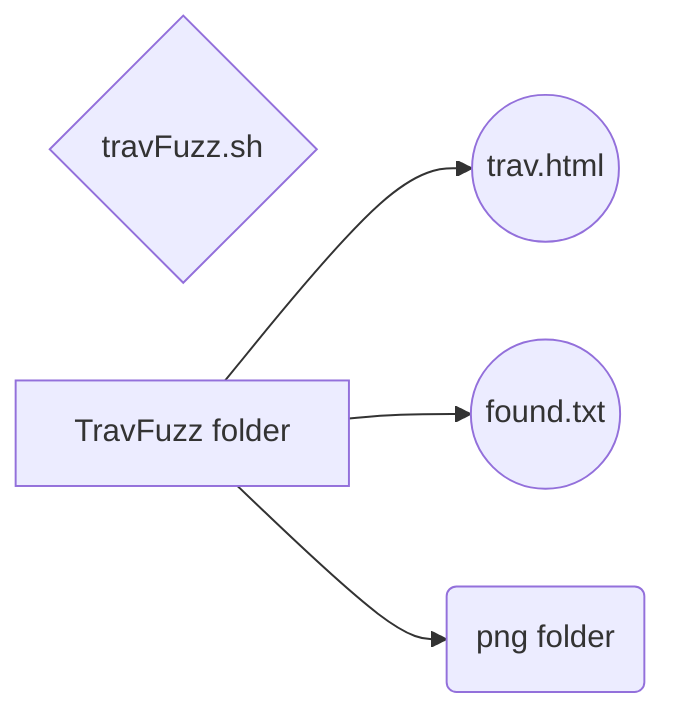

# Welcome to DirTraversalFuzzer!
Hi, this script is used to enumerate a directory traversal vulnerability when found. Just chmod and run the script then supply it the URL where the traversal was found. Then it will organize the found files into an html doc for quick reading of the output. 

Sample of the script being run:

Sample screenshot of the html file output:

>**M**ake sure to edit the script on line 12 to point to the wordlist you want to use.

### My suggested lists

[Linux](http://handlebarsjs.com/)

[Windows](http://handlebarsjs.com/)

## UML diagram
Files created by the script:

trav.html   :   holds results
found.txt  :   holds urls that had hits
png folder:   Used as reference for the html file

